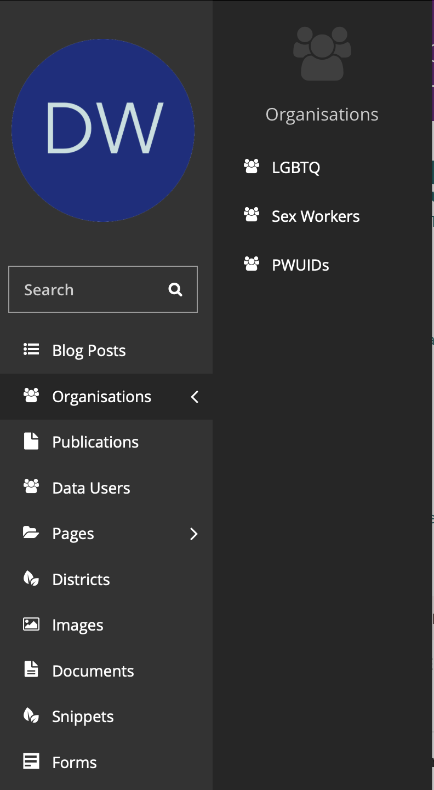
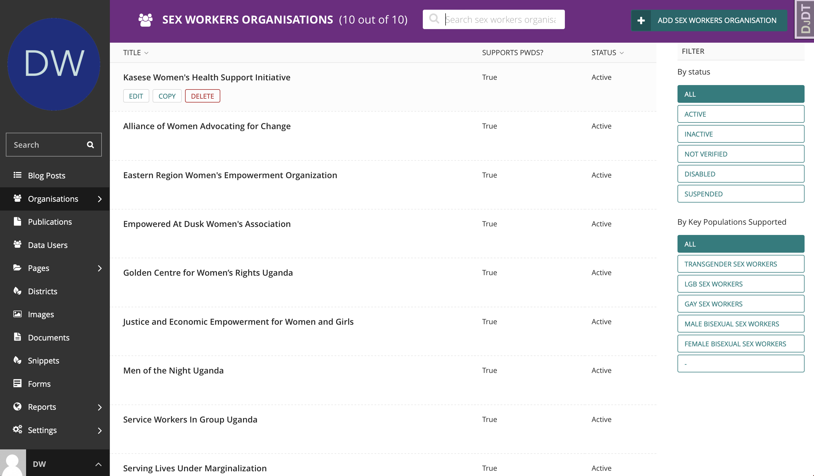
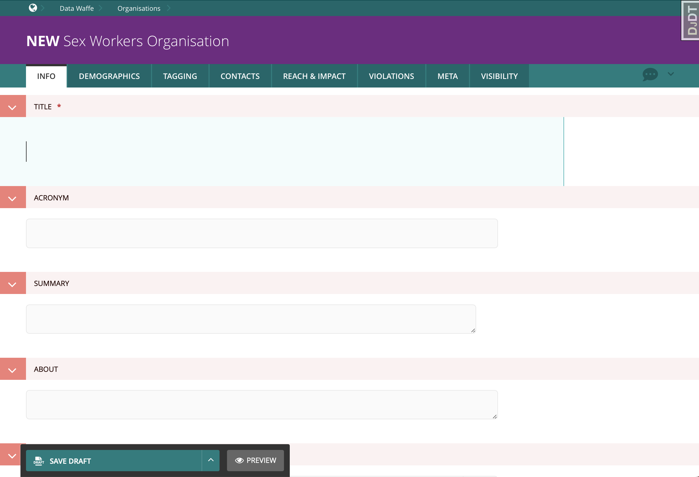

.. title:: Managing Organisations

========================================
Managing Organisations
========================================

In the navigation menu on the left, you will find the Organisations item. Clicking on it opens another navigation (see below)
which allows you to select the types of organisations you want to manage.

Following your choice, you will be redirected to tabulated listing of the existing organisations. 

In this area you can search and filter to narrow down the organisation you are looking for.

Update organisation
================================

From the table of existing organisations, you can click any of the name of the organisations 
which will redirect you to a new page where you can update the organisation's content.

You can also hover over the name of an organisation to reveal a group of action buttons e.g ``EDIT``, ``VIEW LIVE`` and the ``MORE`` dropdown where you can perform
dangerous tasks like *Unpublishing* or *deleting* the organisation (if you have the priviledges). 

Create organisation
================================

In the top right corner, click the ``ADD {} ORGANISATION`` button and you will be redirected to a new page.

Just like the process of creating a new page, you have a number of tabs with different fields for you to fill out. 

The required and most important field is the ``TITLE``. Fill out the fields with the available information and ``PUBLISH`` when ready.