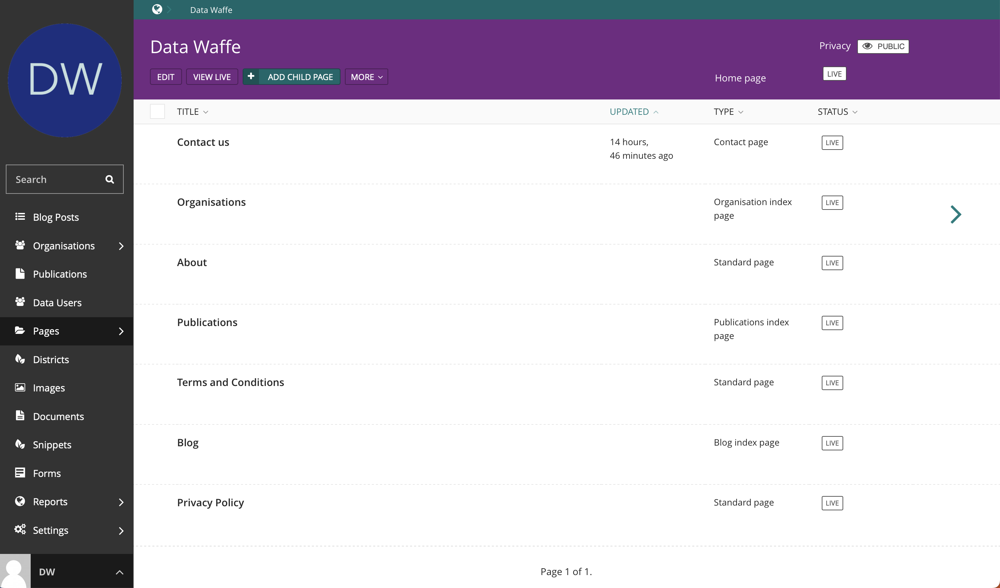
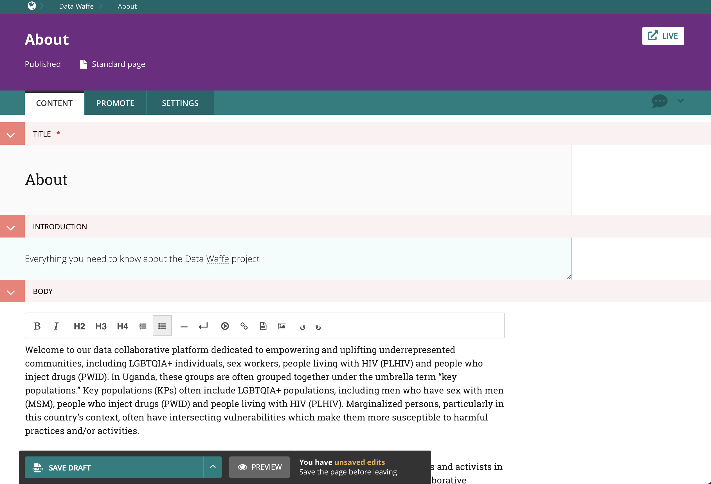
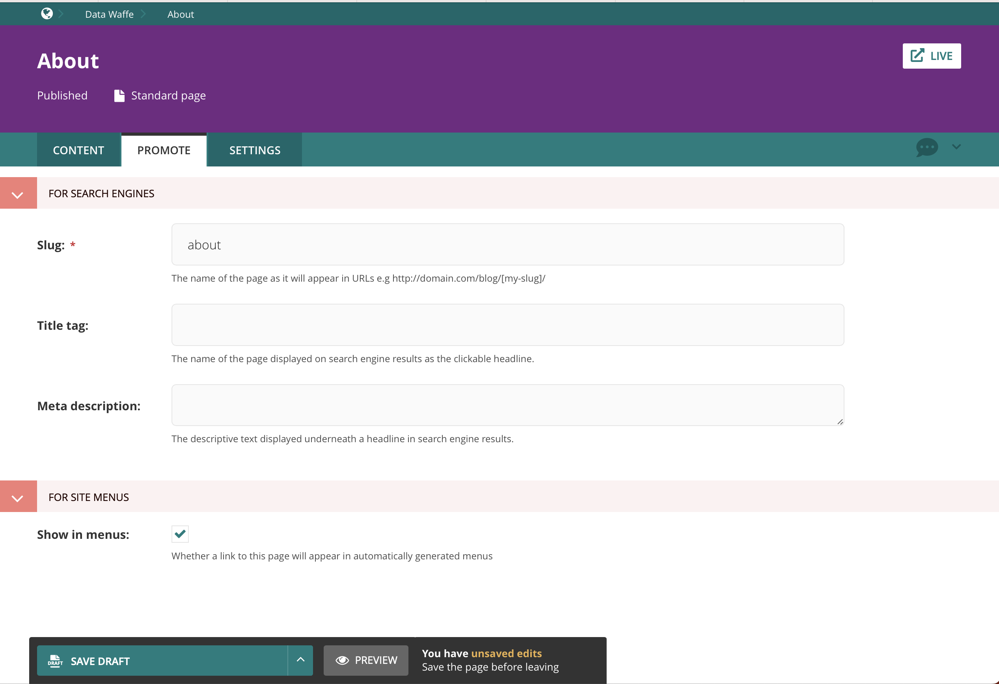
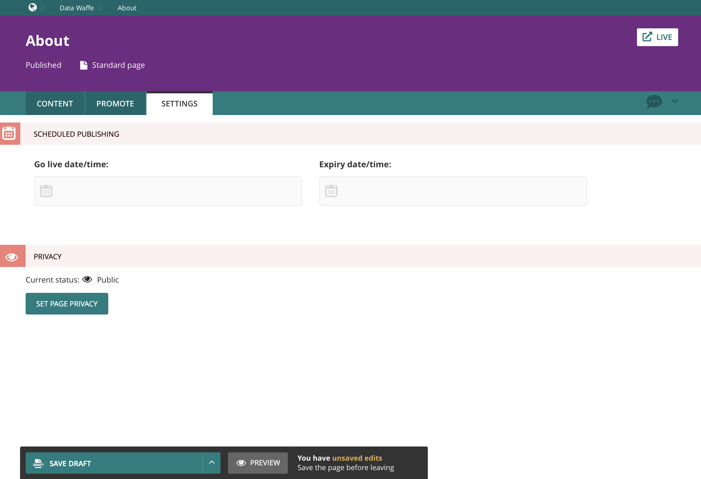
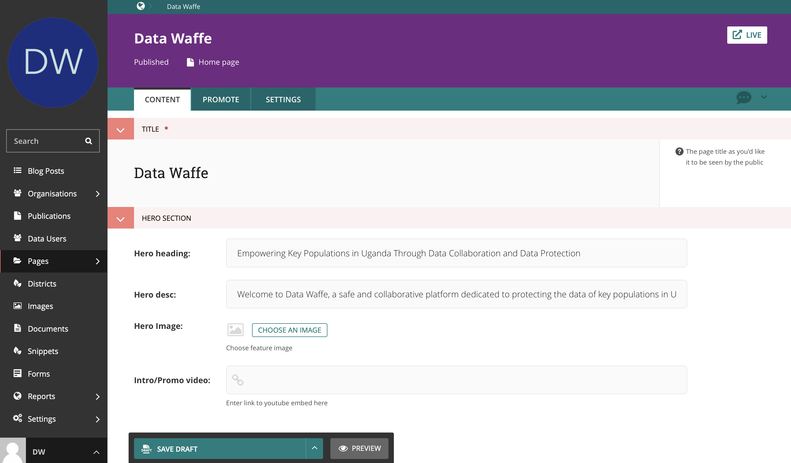

.. title:: Managing Pages

========================================
Managing Pages
========================================

Overview
=================================

Here you will find the pages that make up the entire website including, index pages (e.g Organisations), standard pages (e.g About) and form pages (e.g Contact).

You will notice that all index pages have the green arrow on the far right so you can access the child pages under them e.g Organisations

For example, lets look at what lies under the Home page (see image above):

Just below the title of the Page, there are several toolbar buttons, each with a different function that will be explained briefly here, and in more depth in separate sections of this documentation:

- ``EDIT``: Edit content of the current page (in the image above)
- ``VIEW LIVE``: View the live version of the site, as a user would see
- ``ADD CHILD PAGE``: In this particular case, since we are in the Home Page, this will allow you to add a new standard page. If you were in the Organisations page (an Index page), clicking ``ADD CHILD PAGE`` would allow you to create a new organisation.
- ``MORE``:
  
  - **Move:** This will Change the parent page of the currently selected Page. **DO NOT TOUCH THIS**
  - **Copy:** This will duplicate the current page. **DO NOT TOUCH THIS**
  - **Delete:** Complete delete the current page and all of its child pages(in this case: blogs). **DO NOT TOUCH THIS**
  - **Unpublish:** This option unpublishes the Page and disallows users from accessing it on the live site, optionally disallowing access to child pages (in this case: blogs). Note: if access to child pages is not removed, they will become orphaned meaning that they can be accessed by users, but only through direct URL.
  - **History:** This shows you a log of all the actions taken on this Page.

Below the title area and the toolbars defined above, you have a table showing the existing child pages.

.. note::
    You can change the ordering of items in the table by clicking on the column names. This allows you to view the table items in ascending or descending order depending on the column header clicked. 
    You can play with this. It will help you find the pages to edit faster and won't change how they appear on the live site.

The columns are self explanatory but lets define them quickly:

Title:
    The title of the child page.

Updated: 
    The period of time since the page was last updated. 

Type:
    This describes what type of page it is. In the image above, the child pages are all of the type **Blog**

Status:
    This shows you the state of the child page. If a page is published, the status will show as **Live**. Unpublished pages will have the status: **Draft**.

Editing Pages
=================================

There are usually 3 tabs for every page: ``Content``, ``Promote``, ``Settings``. Some pages, as we will see, have a few more tabs depending on relevant content.

Content tab
###################

Usually in this section, you create the content expected to appear on the frontend. Some of the common fields include:

- **Title:** This is the name of the page which will appear anywhere where this page is presented.
- **Introduction/Summary:** This is usually meant for brief text to describe the page's content.
- **Body:** This is the body of the page. Usually this is a rich field text with options for formatting your content and adding media.

Promote tab
##################

In this section you can configure a page's metadata, to help search engines find and index it. Below is a description of all the default fields under this tab.

**For Search Engines**

* **Slug:** The section of the URL that appears after your website's domain e.g. ``https://datawaffe.org/blog/[my-slug]/``. This is automatically generated from the main page title, which is set in the Content tab. Slugs should be entirely lowercase, with words separated by hyphens (-). It is recommended that you don't change a page's slug once a page is published.

* **Page title:** This is the bold headline that often shows up search engine results. This is one of the most significant elements of how search engines rank the page. The keywords used here should align with the keywords you wish to be found for. If you don't think this field is working, ask your developers to check they have configured the site to output the appropriate tags on the frontend.

**For Site Menus**

* **Show in menus:** Ticking this box will ensure that the page is included in automatically generated menus on your site. Note: A page will only display in menus if all of its parent pages also have *Show in menus* ticked.

* **Search description:** This is the descriptive text displayed underneath a headline in search engine results. It is designed to explain what this page is about. It has no impact on how search engines rank your content, but it can impact on the likelihood that a user will click your result. Ideally 140 to 155 characters in length. If you don't think this field is working, ask your developers to check they have configured the site to output the appropriate tags on the frontend.

* **Search image**: Upload an image that will appear alongside the link in search results or when the link to this page is shared on social media. 

.. Note::
    You may see more fields than this in your promote tab. These are just the default fields, but you are free to add other fields to this section as necessary.

The Settings tab
##################

The *Settings* tab has three fields by default.

* **Go Live date/time:** Sets the date and time at which the changes should go live when published. 
* **Expiry date/time:** Sets the date and time at which this page should be unpublished.
* **Privacy:** Sets restrictions for who can view the page on the frontend. Also applies to all child pages.

Editing the Homepage
=================================

You can edit the homepage by clicking on the ``EDIT`` button in the taskbar (purple header) underneath the title. 

The editing area allows you to manage all the content as it appears on the homepage including headings, buttons, images, etc. 

