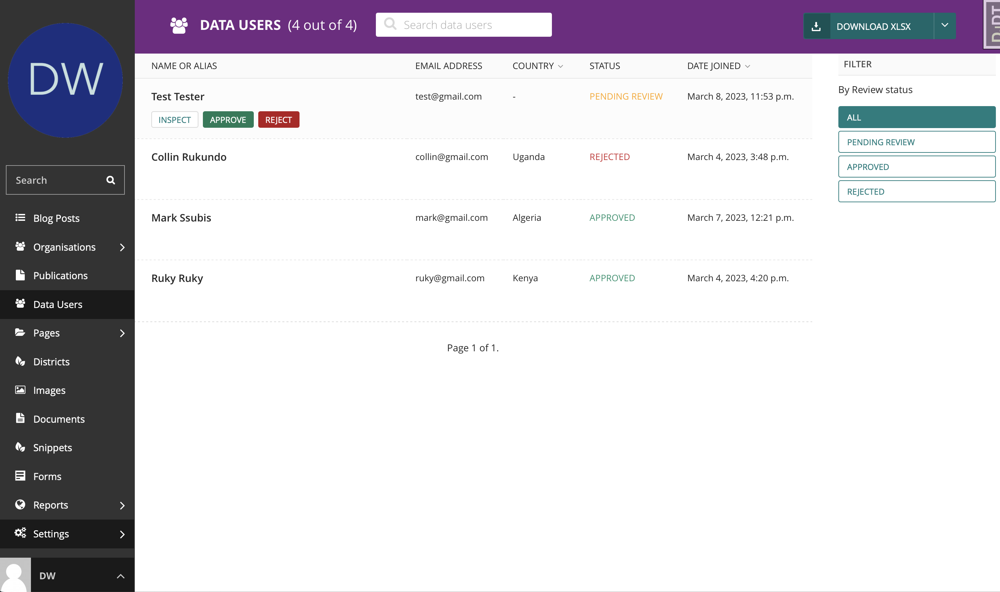
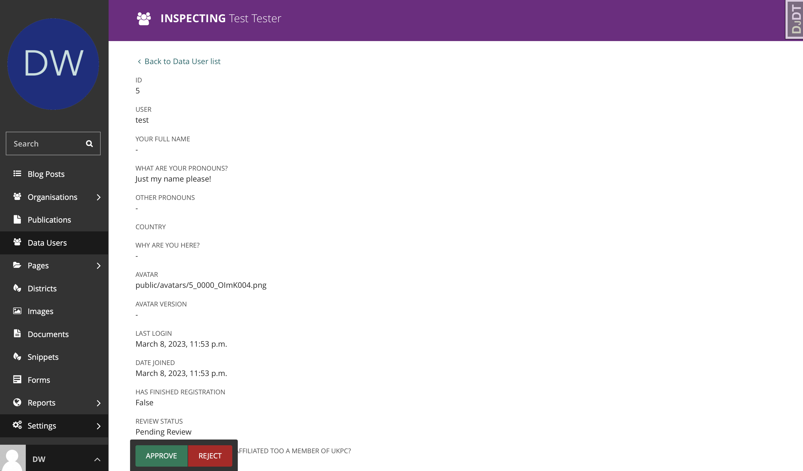
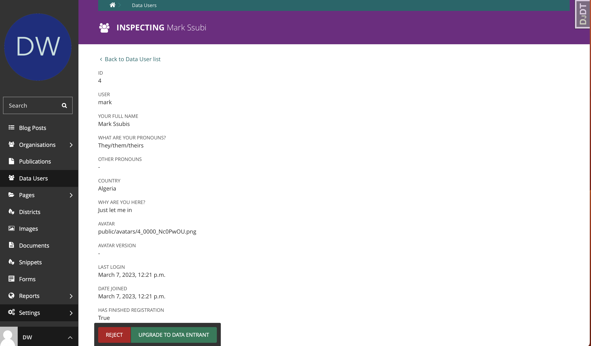

.. title:: Managing Users

========================================
Managing Users
========================================

This section is located under Settings in the navigation menu. 

You will find a tabulated list of all the users who have access to the platform and their priviledges. 

All these users have either been created directly by an Administrator (and have editorial rights) or individually signed up on the front-facing website.

.. figure:: _static/user-area.png
    :alt: User index page
    :width: 800

Creating administrators
============================

Creating a user with any administrative, editorial or moderating priviledges is very straightforward.

Click the ``ADD USER`` button in the header area. On the next page, you can fill out the required user details
usually username, email address and a temporary password among others. 

.. figure:: _static/create-user.png
    :alt: create user
    :width: 800

Assigning privileges
================================

Next, you need to assign the user to a ``User Group`` with privileges befitting their roles. Click the 'Roles' tab to edit the level of access your user has. 

There are three default roles of general users required to review and moderate all website content:

Administrators:
    Administrators have full access to the entire CMS and can create, delete and update any and all content.

Editors:
    Editors can create new elements but they are unable to publish any content. They simply create and review draft content.

Moderators:
    Moderators review content created by themeslves or Administrators and Editors and can publish it so that it is live on the website. 

Moderators and editors have no access to any Settings sections. 

Organisation Editors
================================

``Organisation Editor`` role is assigned specifically to members of organisations who have been tasked with keeping data on their organisations up-to-date.

Their priviledges do not exceed managing the data for the organisations they have been assigned and nothing else. 

In order to assign an ``Organisation Editor``, simply select the organisation in the list of user groups (see image above) and save.

This user will now be able to login to the CMS and manage the organisation's content and media.

.. figure:: _static/user-roles.png
    :alt: User roles section
    :width: 800

Managing data users
================================

Data users are a type of user created through signing up on the website individually. They saw a need
for the data in their work and want access to more granular data and visualizations so they created an account.

Typically, this user signed up, verified their email and even filled out his profile including their name, country and organisation 
among other things.

These accounts are inactive ``PENDING REVIEW`` by default pending verification. The user will not be able to login until their account is approved.

One of the administrators at Data Waffe has to review each account manually and ``APPROVE`` or ``REJECT`` it. 

Reviewing User
--------------------------------

Prior to approving or rejecting an account, the responsible admin can ``INSPECT`` the account to review the information submitted by the user. 

Reject User
--------------------------------

Click the big red ``REJECT`` button at the bottom of the screen. The user will receive an email in a couple of seconds 
informing them that their request has been rejected and they are unable to access any of the data on Data Waffe. 

Approving User
--------------------------------

Click the big green ``APPROVE`` button at the bottom of the screen. The user will receive an email in a couple of seconds welcoming them to Data Waffe and
reminding them of the terms they are bound to. The status of their account is changed from ``PENDING REVIEW`` to ``APPROVED`` and marked ``active``.

This user can now access previously restricted data on the public Data Waffe platform.

Upgrade to Data Entrant
--------------------------------

Ordinary data users once approved can be upgraded to Data Entrant at a specified organisation once their profile has been reviewed.

To upgrade a user to data entrant, select ``INSPECT`` for the user you want to upgrade and at the bottom of the page that follows, 
click on the big green ``UPGRADE TO DATA ENTRANT`` button. You will be redirected to the User's settings screen where you can assign
the user to the user group of a specified Organisation.

