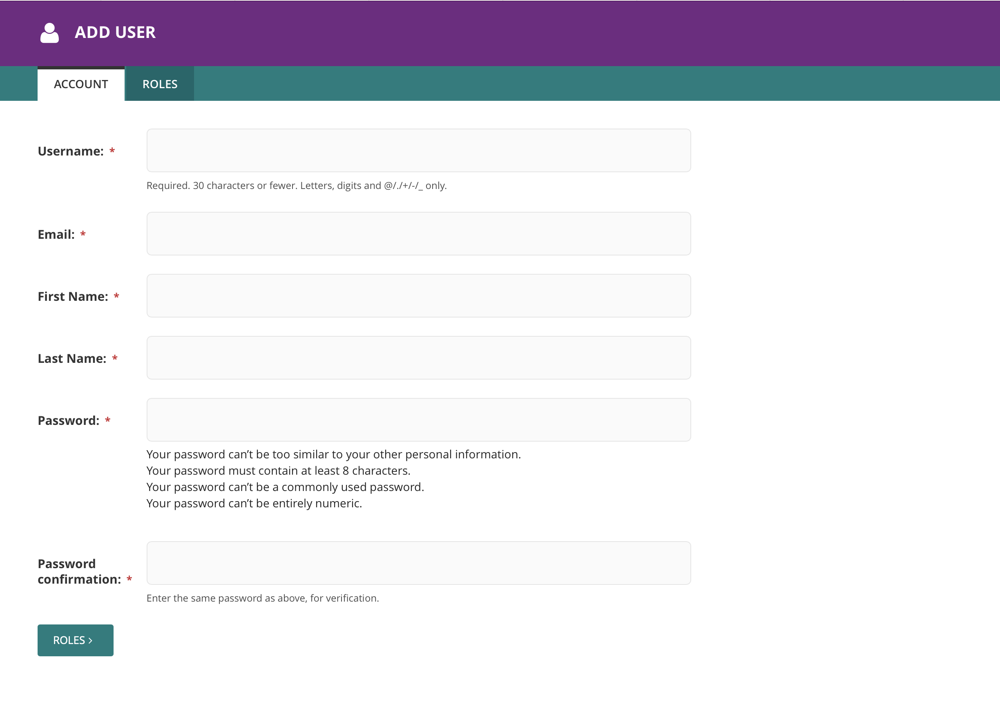
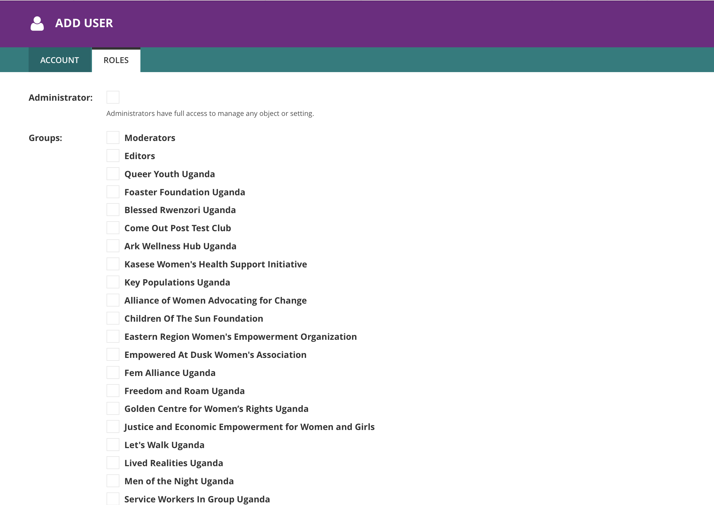

.. title:: Managing Users

========================================
Managing Users
========================================

This section is located under Settings in the navigation menu. 

You will find a tabulated list of all the users who have access to the platform and their priviledges. 

All these users have either been created directly by an Administrator (and have editorial rights) or individually signed up on the front-facing website.

.. figure:: _static/user-area.png
    :alt: User index page
    :width: 800

Creating administrators
============================

Creating a user with any administrative, editorial or moderating priviledges is very straightforward.

Click the ``ADD USER`` button in the header area. On the next page, you can fill out the required user details
usually username, email address and a temporary password among others. 

Assigning privileges
================================

Next, you need to assign the user to a ``User Group`` with privileges befitting their roles. Click the 'Roles' tab to edit the level of access your user has. 

There are three default roles of general users required to review and moderate all website content:

Administrators:
    Administrators have full access to the entire CMS and can create, delete and update any and all content.

Editors:
    Editors can create new elements but they are unable to publish any content. They simply create and review draft content.

Moderators:
    Moderators review content created by themeslves or Administrators and Editors and can publish it so that it is live on the website. 

Moderators and editors have no access to any Settings sections. 

Organisation Editors
================================

``Organisation Editor`` role is assigned specifically to members of organisations who have been tasked with keeping data on their organisations up-to-date.

Their priviledges do not exceed managing the data for the organisations they have been assigned and nothing else. 

In order to assign an ``Organisation Editor``, simply select the organisation in the list of user groups (see image above) and save.

This user will now be able to login to the CMS and manage the organisation's content and media.

