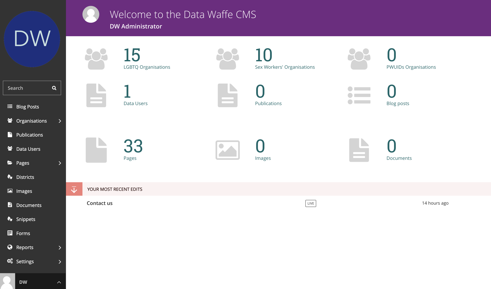
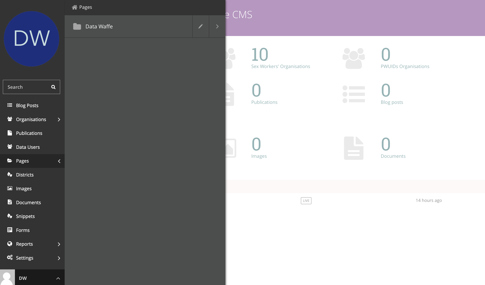
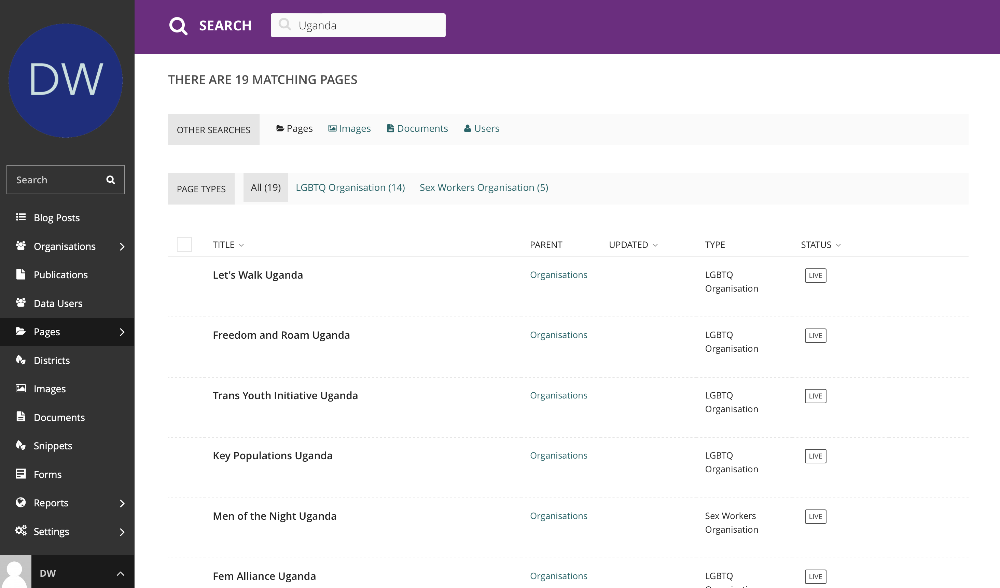

Navigating the CMS
===================================

Once you have logged in successfully, you will be redirected to the Dashboard. 

Main dashboard
--------------
On the left (dark background) is the Navigation Menu which is used to nagivate to and edit various parts of the CMS. 
At the top of the main section, you can see various numbers summarizing the content hosted on the platform.

You can return to the Dashboard at any time by clicking the round Data Waffe logo in the top left corner.

- The Dashboard shows the number of Pages, images, documents and associated languages currently stored on Wagtail.
- If you are authorized to moderate/review Pages, there will be a list of Pages awaiting your approval. 
  Hovering over the title of the Page will give you several options:

  - **Request changes:** reject the changes and a comment explaining why
  - **Approve:** approve the changes and publish the Page
  - **Approve with comment:** approve the changes and publish the Page, adding a comment
  - **Edit:** edit the Page yourself
  - **Preview:** preview the changes on the frontend of the site
  
- If you have recently edited Pages, there will also be a list of your 5 most-recently edited Pages
- Clicking on the title of any Page in the Dashboard will take you to its Edit interface
- Each of the Page lists on the Dashboard also have a status:
  
  - Pages awaiting review will show the review status
  - Pages you have recently edited will show whether it is ``Live``, ``Draft``, or ``Live + Draft`` (indicating the Page is published but newer revisions are in a Draft state)

The Pages Menu
-------------------

The Pages Menu enables quick navigation through the levels of the site. Navigation using this menu enables you to move past a navigational level by clicking on the right arrow - or to open a navigational level by clicking its name. You can also navigate back by clicking the name of the containing folder above the list.

The top level of the Pages menu will be the home page (Data Waffe). Remember what we said about all pages deriving from this root page? All other standard and index pages will be created under this page.

    

**Here's what you need to know:**

- Click the Pages button in the sidebar to accesss the Menu.
- Clicking the name of a page will take you to the child pages within that page or to the page edit screen depending on where the page is in the hierachy.
- Clicking the right arrow displays the pages and enables you to navigate through the content structure.
- The more right arrows you click, the further down the content structure you move.

Searching Data Waffe
----------------------------

To quickly locate users, organisations, publications, articles or find information, use the search functionality. This is located in the navigation menu on the left and just below the Data Waffe Logo.

This is how it works:

- Simply type in the name of the page you are looking for and hit enter.
- Clicking the title of any item in the results that follow will take you to its ``Edit`` page.
- You can filter the search results by content type i.e Page, Image, Document, Users, etc. 
- Different content types have different options for further filtering.
- Search results can be sorted by column simply by click on the column header

